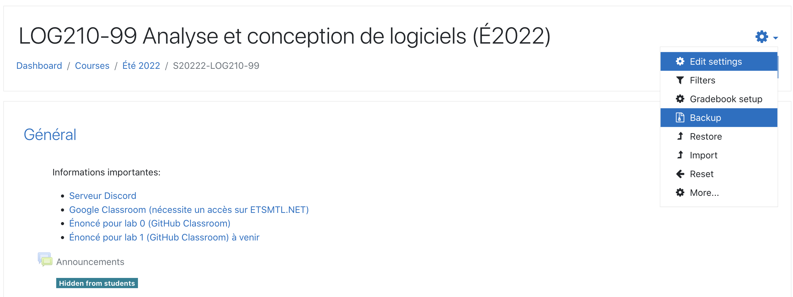
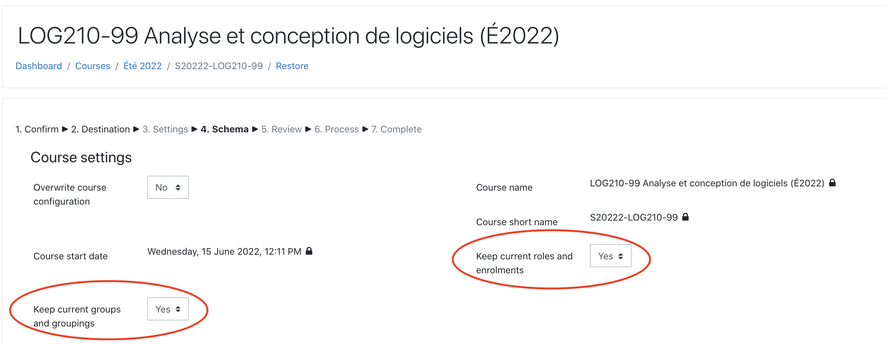

## Getting Started


First, run the development server:

```bash
npm run dev
# or
yarn dev
# or
pnpm dev
```

Open [http://localhost:3000](http://localhost:3000) with your browser to see the result.

You can start editing the page by modifying `pages/index.tsx`. The page auto-updates as you edit the file.

[API routes](https://nextjs.org/docs/api-routes/introduction) can be accessed on [http://localhost:3000/api/hello](http://localhost:3000/api/hello). This endpoint can be edited in `pages/api/hello.ts`.

The `pages/api` directory is mapped to `/api/*`. Files in this directory are treated as [API routes](https://nextjs.org/docs/api-routes/introduction) instead of React pages.

This project uses [`next/font`](https://nextjs.org/docs/basic-features/font-optimization) to automatically optimize and load Inter, a custom Google Font.
## Architecture
This application is running on static single page. It is designed to be deployed on serverless hoster. This means that all of the code must run in the browser. It also means that our architecture is heavily influenced by the front-end framework that the application uses (which is next.js). Since all the logic will be stored in the client-side code, without proper organization the code base is at rick of becoming extremely chaotic, unpractial and hard to maintain. To prevent this we opted for a MVC design. React is not meant to build MVC applications so our architecture diagram will seem a little unusual.

 

We used react's contexts to expose a component's functions or data. For example, the CalModel component, who has the role of holding the in-memory collections of data and saving it to the local store when it changes, creates a context when used in a DOM tree. This context will expose the events data collection and the setEvents function handle. Children of this component will have access to the elements exposed by the context provider. The same logic applies to the controller who designed to be the child of CalModel. This relation will allow CalController to access CalModel context but will not permit CalModel to access CalController context. With this architecture, and react functionality, when ClearCalButton notifies CalController of a button push by calling it's notifyClearEvents function, CalController will only have to use the setEvents function handle of CalModel with an empty collection and the state of the object will be automatically synchronized with everyone who uses it (EventCalendar in this example). Note that this diagram is not exhaustive and that its purpose is only to illustrate the general architecture of the application and the interactions between its components. If we were to translate this diagram into a more conventional form by not representing the context interaction, we will get the more traditional-looking diagram: 


## Moodle step by step

The following section will guide you through using the application to modify the dates of activities in a Moodle course.

> Because this tool modifies a backup file that will later be used to restore (and overwrite) activities in the course, it is highly recommended that you use this tool *before* students are enrolled in the course (and have begun activities).
> **Use at your own risk!**  
> Note: these instructions may be different depending on your version of Moodle.
> This tool was tested with Moodle version 3.x.
> Please see the documentation for the various steps according to your version of Moodle.

### Step 1. Create a Moodle backup file

The first thing to do is to create a Moodle backup file.
This can be done through the Moodle UI.
You must have the teacher role in a course to do so.

To create the file, go to your Moodle class.
Use the cogwheel at the top right of your screen and click "Backup".
You can then click "Jump to final step" to export it or configure your exportation settings accordingly. 




After it finishes, you can press "Continue".
You should see your backup Moodle file in the "User private backup area" section.
Download the file and save it on your computer.


### Step 2. Select new Course to plan

To use the application, you must specify which class it is for:


Then click the `Envoyer` button to get the class calendar like so:


### Step 3. Import the Moodle backup file

By selecting the `Sélectionner une sauvegarde Moodle` button, you can import the backup file.
Then you will be prompted the indicate which course does the backup file belong to:


When the import is done, you will be able to see the activity inside of the backup file:


### Step 4. Use the suggestion

Inside the application there is a algorithm to pre-plan the course to save time.
You can use it on selection the `Suggestion` button:


After, you will prompted for specification on where to bind your evaluation and hamowork:


The result will appear in the calendar in a light color to indicate temporary result which can be confirm with the `Tout Saugarder` or modify it further.


### Step 5. Modify the event individually

Once the suggestion is done, you can select any event the modify it separately. The selected event is represented by a purple overlay:


At the botton of the list you will see the detail for the selected event which have a few option:


Inside the detail, you have:
- The Start and Finish sub section where you will imput the relevant informations
- The first row is the specify which course should it start and at what time; at the start of the class or at the end
- The second row is for the finer detail such as the gap between the class and the event (it can be +/- value) and a absolute time indication (ex: 23:59)

### Step 6. Export the DSL for next semester

To improve your speed and efficiency, we recommend that you save the DSL in a word document for further use in the next semester.
The DSL will represent all the changes you have made and will make it easier and faster next time.
To export the configuration click on the `DSL` button in the Advanced options:


which you will find you current configuration ih this section:


### Step 7. Export the new backup file 

Once you are done, you can click the `Exporter` button at the end of the page. 
This will download the new modified backup file.

Go back to your Moodle course and use the cogwheel to navigate to "Restore".
You can then drag and drop the new Moodle backup file in the "Import a backup file" box.
Click "Restore".


Scroll down and click "Continue".
On the next page, you need to check "Delete the contents of this course and then restore".
If this option is not checked, your Moodle course will contain duplicated activities.
This is the reason we recommend you only use this tool on a course that does not yet have students enrolled (and possibly activities that have begun).


Click "Continue" and then "Next" on the next page.

On the current page, it is important to change "Keep current groups and groupings" and "Keep current roles and enrolments" to "Yes".
Without this change, your current roles and groups of the course will be deleted.
The users assigned in the current course would also be deleted.



Scroll down and click "Next".
On the next page, scroll down and click "Restore".
This process might take a while.
As long as a circle is spinning in your browser tab, the process is still running.
Once the process is done, check to see if your Moodle activity dates have been updated.
> The Moodle calendar is an excellent way to visualize the dates.


